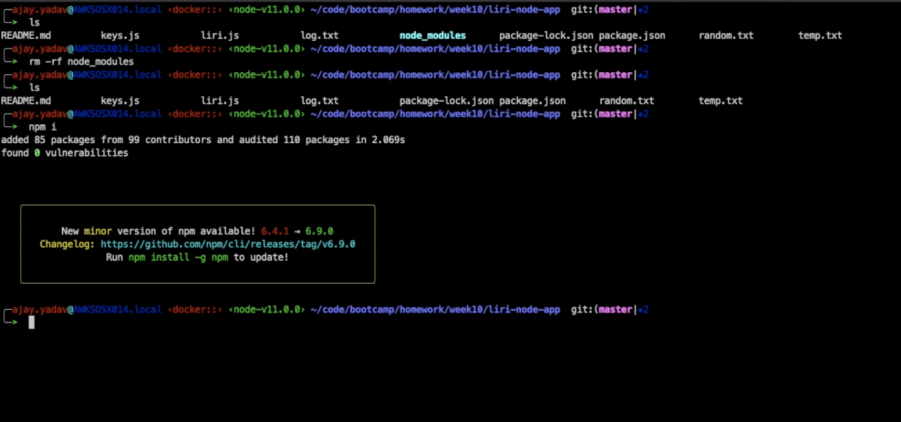

# liri-node-app
This is a CLI based project that emulates a personal smart assistant. LIRI is like iPhone's SIRI. However, while SIRI is a Speech Interpretation and Recognition Interface, LIRI is a Language Interpretation and Recognition Interface. LIRI will be a command line node app that takes in parameters and gives you back data

  * `concert-this`

  * `spotify-this-song`

  * `movie-this`

  * `do-what-it-says`

## Getting Started

- Clone or fork the repo.
- Run command 'npm install' in Terminal or GitBash
- Run command 'node liri.js' or one of the commands below.

## What Each Command Does

1. `node liri.js concert-this <artist/band name here>`

  * This will search the Bands in Town Artist Events API for an artist and render the following information about each event to the terminal:
     * Name of the venue
     * Venue location
     * Date of the Event (use moment to format this as "MM/DD/YYYY")

2. `node liri.js spotify-this-song <song name>`

   * This will show the following information about the song in your terminal/bash window
     * Artist(s)
     * The song's name
     * A preview link of the song from Spotify
     * The album that the song is from
   * If no song is provided then your program will default to "The Sign" by Ace of Base.

3. `node liri.js movie-this <movie name>`

   * This will output the following information to your terminal/bash window:
       * Title of the movie.
       * Year the movie came out.
       * IMDB Rating of the movie.
       * Rotten Tomatoes Rating of the movie.
       * Country where the movie was produced.
       * Language of the movie.
       * Plot of the movie.
       * Actors in the movie.
   * If the user doesn't type a movie in, the program will output data for the movie 'Mr. Nobody.'

4. `node liri.js do-what-it-says`

  * Takes the text from random.txt and runs the song through spotify-this-song command

## Tech used
- Node.js
- Twitter NPM Package - https://www.npmjs.com/package/twitter
- Spotify NPM Package - https://www.npmjs.com/package/spotify
- Request NPM Package - https://www.npmjs.com/package/request

## Prerequisites
```
- Node.js - Download the latest version of Node https://nodejs.org/en/
```

## Video of the application in action
[](https://youtu.be/sZTFc2UZ21I)

